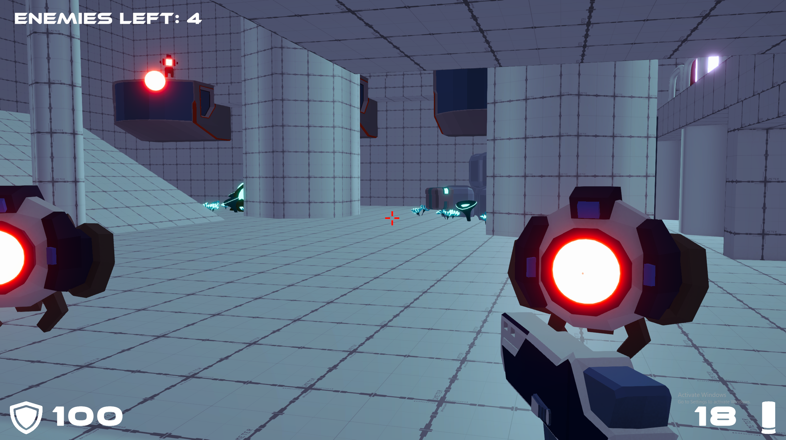
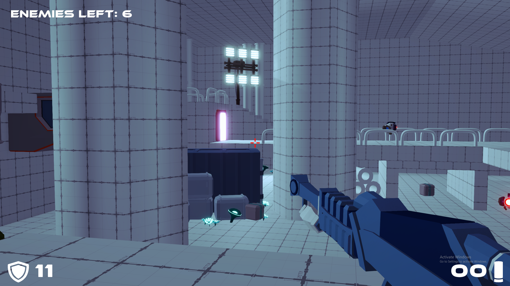
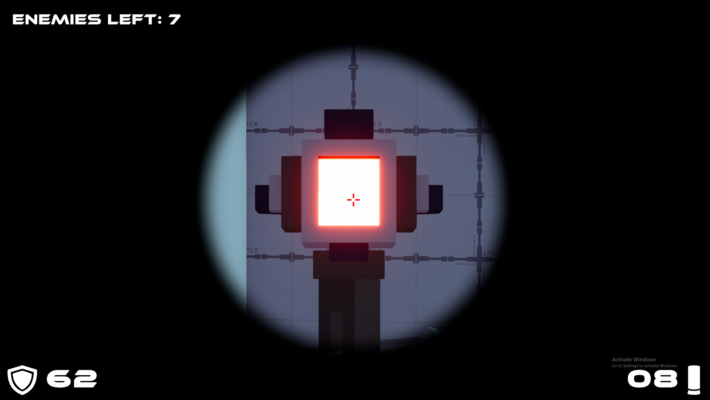

# FPS_Shooter_3D_Game_Prototype

First Person 3D Shooter Game with Enemy Spawn System and Turrets. 
The game prototype features 3 different weapons: Pistol, Machine Gun and Sniper Rifle.
The prototype has 1 Level, with win and lose conditions implemented.

In order to win All Enemy Spawners and Enemy Robots must be destroyed.
To replenish Ammo pick up Ammo Boxes which can be found accross the Level.

## Screenshots

## Game Controls
- WASD for Movement
- SHIFT for Running
- HOLD RIGHT CLICK for Scope Mode with Sniper Rifle
- SPACE for Jumping
- LEFT CLICK for Shooting
- Use ESC key for Pause Menu

## How to install?
### For Windows User
- Clone the Repository.
- Open Folder Named "Windows_Build.zip".
- Extract the Files.
- Run FPS_Shooter_3D exe file.

## Tools used while developing this project
- Unity.
- Visual Studio Code.
- Coding in C# Programming Language.
- GitBash.
  
## Contacts 
- E-mail address orkhan.elchuev@gmail.com
- https://github.com/OrkhanElchuev/Spookland
  
## Acknowledgements
- Level Assets - [Unity StarterPack Assets](https://assetstore.unity.com/packages/essentials/starter-assets-firstperson-updates-in-new-charactercontroller-pa-196525)
- Weapon and Enemy Assets - [GDTV Assets](https://gamedev.tv/products?page=1&types=AssetPack)
- VFX Effects - [Simple FX](https://assetstore.unity.com/packages/vfx/particles/simple-fx-cartoon-particles-67834)
- Fonts - [dafont](https://www.dafont.com/de/ethnocentric.font)
